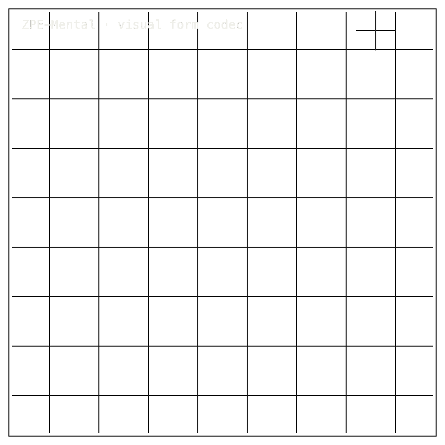

# ZPE-Mental

## Install / Developer Commands

<!-- INSTALL-DX:START -->
#### Package Install

Installable package: `python3.11 -m pip install zpe-mental`.
Current release: `0.1.0` on [PyPI](https://pypi.org/project/zpe-mental/).
Source: [Zer0pa/ZPE-Mental](https://github.com/Zer0pa/ZPE-Mental/).

```bash
python3.11 -m pip install zpe-mental
```

Import smoke:

```bash
python3.11 - <<'PY'
import importlib.metadata as md
import zpe_mental

print("zpe-mental", md.version("zpe-mental"))
PY
```

Install success only proves package acquisition/import. Product scope, stale PyPI state, platform limits, and blockers remain in the front-door sections below.
- Current PyPI surface is Linux cp311 wheel-only with no sdist; use Python 3.11 for smoke checks.
<!-- INSTALL-DX:END -->

#### Quick Start

```bash
python3 - <<'PY'
import sys
raise SystemExit(0 if sys.version_info >= (3, 11) else "Python 3.11+ is required")
PY
cargo --version
python3 -m venv .venv
. .venv/bin/activate
python -m pip install --upgrade pip
python -m pip install ".[test]"
python scripts/validate_release.py --output proofs/artifacts/mental_release_matrix.json
pytest tests -q --junitxml validation/results/pytest.xml
```

<table width="100%">
<tr>
<td width="100%" valign="top">
<div><span><b>00 · ZPE-MENTAL</b> · VISUAL FORM CODEC</span> <span>LIVE LANE · 032114Z</span></div>
      <h1>Tracing mental images <span>for a codec.</span></h1>
      <p>Four-form endogenous-visual codec &middot; ZPE-Mental &middot; PyPI <em>zpe-mental</em> v0.1.0 &middot; github.com/Zer0pa/ZPE-Mental</p>
      <p>Perceptual science has described tunnel, spiral, lattice, and cobweb for nearly a century &mdash; the four Klüver form constants people see in the mind's eye &mdash; but no one had ever pinned them to an exact, replayable shape. ZPE-Mental writes each form into a <strong>20-bit packet</strong> and brings it back byte-identical across a Rust-native fast path and a Python reference. Non-visual prompts collapse to a bounded fallback. <em>No cognition, clinical, diagnostic, or autobiographical claim is made</em> &mdash; just the four forms, replayed exactly.</p>
</td>
</tr>
</table>

<table width="100%">
<tr>
<td width="100%" valign="top">
<figure>
        <div></div>
        <figcaption><b>Scope:</b> four Kluever visual-form constants. No cognition, clinical, diagnostic, memory, or autobiographical claim.</figcaption>
      </figure>
</td>
</tr>
</table>

<table width="100%">
<tr>
<td width="100%" valign="top">
<div><b>01 · THE GAP</b> <span>DESCRIBED, NOT CAPTURED</span></div>
      <h2>These forms have been described in words for a century. None captured exactly.</h2>
</td>
</tr>
</table>

<table width="100%">
<tr>
<td width="100%" valign="top">
<div><b>02 · MARKETS</b> <span>ADJACENT FORECASTS</span></div>
      <div>
        <div>
          <div><span>NIH BRAIN Initiative FY24</span>  <span>$0.75B/yr</span></div>
          <div><span>Perceptual/cognitive neuroscience software &rsquo;30</span>  <span>est. $0.8B</span></div>
          <div><span>Open-science replication infrastructure &rsquo;28</span>  <span>est. $0.3B</span></div>
          <div><span>Psychedelic research clinical trials &rsquo;30</span>  <span>est. $0.5B</span></div>
          <div><span>Computational neuroscience tooling &rsquo;30</span>  <span>est. $1.1B</span></div>
        </div>
      </div>
      <div>Adjacent research-infrastructure estimates only; ZPE-Mental is a small replay tool for four named visual forms, not a market claim.</div>
</td>
</tr>
</table>

<table width="100%">
<tr>
<td width="50%" valign="top">
<div><b>03 · VALUE OF MARKET</b></div>
      <div><span>$0.75</span> <span>B/yr</span></div>
      <div>NIH BRAIN Initiative annual funding; ZPE-Mental serves perceptual research as a <b>four-form fixture tool</b>.</div>
</td>
<td width="50%" valign="top">
<div><b>04 · INSIGHT</b></div>
      <h2>Fix the form. Tunnel, spiral, lattice, cobweb &mdash; <span>the same shape every time.</span></h2>
</td>
</tr>
</table>

<table width="100%">
<tr>
<td width="50%" valign="top">
<div><b>05.1 · CURRENT TECH</b> <span>DESCRIBED, NOT PINNED</span></div>
        <p>Klüver named these four forms in 1928, and perceptual science has studied them ever since. Yet every reference depends on prose, sketches, or rendered images that drift between researchers, devices, and decades. The form itself was never standardised.</p>
</td>
<td width="50%" valign="top">
<div><b>05.2 · OUR TECH</b> <span>PIN THE FORM</span></div>
        <p>ZPE-Mental writes each of the four forms into a <strong>20-bit packet</strong> with profile and symmetry metadata, then returns the exact same bytes whether it runs in Rust or in Python. Non-visual prompts collapse to a documented fallback rather than producing a plausible-looking form. Two profiles &mdash; <strong>COMPASS_8</strong> and <strong>D6_12</strong> &mdash; are represented; coverage stays narrow on purpose.</p>
</td>
</tr>
</table>

<table width="100%">
<tr>
<td width="100%" valign="top">
<div><b>05.3 · BENCHMARKS</b> <span>FOUR-FORM CORPUS</span></div>
      <div>
        <div>
          <div><span>FORM_EXACT</span><b>1.00</b><small>fidelity</small></div>
          <div><span>Rust ↔ Python</span><b>0.00</b><small>bytes Δ</small></div>
          <div><span>Pytest</span><b>3/3</b><small>PASS</small></div>
          <div><span>PyPI</span><b>0.1.0</b><small>stale</small></div>
        </div>
        <div>
          <div><span>tunnel</span>  <span>1.00</span></div>
          <div><span>spiral</span>  <span>1.00</span></div>
          <div><span>lattice</span>  <span>1.00</span></div>
        </div>
      </div>
      <div><b>Scope:</b> four named forms only &middot; 20-bit packet &middot; cobweb 1.00</div>
</td>
</tr>
</table>

<table width="100%">
<tr>
<td width="34%" valign="top">
<div><b>06 · MEASUREMENT</b> <span>CORPUS PARITY CHECK</span></div>
      <h2>Each form measured against a known reference, <span>replayed identically every run.</span></h2>
</td>
<td width="66%" valign="top">
<div><b>06.1 · COMPARATIVE PERFORMANCE</b> <span>FOUR-FORM FORM_EXACT</span></div>
      <div>
        <div>
          <div><span>Tunnel</span>  <span>1.00</span></div>
          <div><span>Spiral</span>  <span>1.00</span></div>
          <div><span>Lattice</span>  <span>1.00</span></div>
          <div><span>Cobweb</span>  <span>1.00</span></div>
        </div>
      </div>
      <div>FORM_EXACT fidelity &middot; ZPE-Mental 0.1.0 &middot; <strong>validation/corpora/endogenous_forms.json</strong> &middot; Rust &harr; Python byte equality (0-byte delta); four named forms only, no external clinical comparator.</div>
</td>
</tr>
</table>

<table width="100%">
<tr>
<td width="100%" valign="top">
<div><b>07 · KEY METRICS</b> <span>FOUR-FORM AGGREGATE</span></div>
</td>
</tr>
</table>

<table width="100%">
<tr>
<td width="100%" valign="top">
<div><b>07.1 · FORM FIDELITY</b></div>
      <div>1.00</div>
      <div>FORM_EXACT · <b>four named forms</b></div>
</td>
</tr>
</table>

<table width="100%">
<tr>
<td width="100%" valign="top">
<div><b>07.2 · RUST ↔ PYTHON</b></div>
      <div>0.00<span>B</span></div>
      <div>Byte delta · <b>fast path = reference</b></div>
</td>
</tr>
</table>

<table width="100%">
<tr>
<td width="100%" valign="top">
<div><b>07.3 · PYTEST SUITE</b></div>
      <div>3 / 3</div>
      <div>PASS · <b>v0.1.0 commit e3412beb</b></div>
</td>
</tr>
</table>

<table width="100%">
<tr>
<td width="100%" valign="top">
<div><b>07.4 · PYPI STATE</b></div>
      <div>0.1.0</div>
      <div>CONNECTED · <b>STALE PENDING 0.1.1</b></div>
</td>
</tr>
</table>

<table width="100%">
<tr>
<td width="100%" valign="top">
<div><b>07.5 · WIRE FORMAT</b></div>
      <div>20<span>-bit</span></div>
      <div>Four fixtures · <b>two profiles represented</b></div>
</td>
</tr>
</table>

<table width="100%">
<tr>
<td width="100%" valign="top">
<div><b>08 · DETERMINISM</b> <span>BYTE-EXACT FOUR-FORM REPLAY</span></div>
      <h2>Tunnel, spiral, lattice, cobweb &mdash;<br/><span>byte-exact across Rust and Python.</span></h2>
</td>
</tr>
</table>

<table width="100%">
<tr>
<td width="66%" valign="top">
<div><b>08.1 · WHAT DETERMINISTIC MEANS</b> <span>FOUR-FORM SURFACE</span></div>
      <p>Each of the four named forms &mdash; tunnel, spiral, lattice, cobweb &mdash; encodes into a <strong>20-bit wire format</strong> and decodes to <em>byte-identical bytes</em> across the Rust-native fast path and the Python reference. <strong>FORM_EXACT = 1.00</strong> is the falsification check. Non-visual prompts do not silently produce a plausible form: they collapse to a documented fallback (NON_VISUAL_SEMANTIC_RETENTION 0.00, NON_VISUAL_ALIAS 1.00) so that any non-visual input is recoverable as such. The COMPASS_8 and D6_12 profiles are represented, not exhaustive.</p>
</td>
<td width="34%" valign="top">
<div><b>08.2 · THE FIDELITY GAP</b></div>
      <span>Honest Blocker ·</span>
      <p>No cognition decoding, autobiographical recovery, language understanding, theorem proving, legal or moral reasoning, clinical diagnosis, therapy, medical-device, regulatory, mental-health-assessment, or prosthetics use. <strong>The release corpus is exactly four endogenous visual-form examples &mdash; tunnel, spiral, lattice, cobweb.</strong> No all-forms/all-profiles coverage; PyPI remains 0.1.0 stale pending 0.1.1 metadata release.</p>
</td>
</tr>
</table>

<table width="100%">
<tr>
<td width="33%" valign="top">
<div><b>09</b> </div>
      <h2>FOUR FORMS, ONE <span>CITABLE SHAPE.</span></h2>
</td>
<td width="67%" valign="top">
<div><b>09.1 · THE AMBITION</b></div>
      <p>ZPE-Mental gives perceptual science its first deterministic packet for the Klüver form constants. Tunnel, spiral, lattice, and cobweb become stable fixtures a psychophysics lab can specify, share, and replay without arguing over rendering or wording &mdash; a small, exact contribution to a question that has resisted exact treatment since <strong>1928</strong>.</p>
</td>
</tr>
</table>

<table width="100%">
<tr>
<td width="33%" valign="top">
<div><b>09.2 · WHAT WORKS NOW</b> <span>EXTERNAL</span></div>
        <h2>Working today: four named forms at FORM_EXACT 1.00; Rust and Python decode identically; three of three tests pass.</h2>
</td>
<td width="67%" valign="top">
<div><b>09.3 · WHAT'S STILL OPEN</b> <span>EXTERNAL</span></div>
        <h2>Still open: broader form coverage, full profile range, and the 0.1.1 metadata release that retires the stale PyPI 0.1.0.</h2>
</td>
</tr>
</table>

<table width="100%">
<tr>
<td width="100%" valign="top">
<div><b>09.4</b> &middot; REPLICATION · NEAR-TERM (12–24 MO)</div>
      <div>Perceptual experiments get a shared vocabulary</div><div>A psychophysics group that ran a tunnel-stimulus study in 2024 can hand a 20-bit packet to a 2026 replication team and know both labs are testing the exact same shape &mdash; not a screenshot, not a verbal description.</div>
</td>
</tr>
</table>

<table width="100%">
<tr>
<td width="100%" valign="top">
<div><b>09.5</b> &middot; STIMULUS LIBRARIES · NEAR-TERM (12–24 MO)</div>
      <div>Stimulus libraries get a fidelity floor</div><div>A perception lab maintaining a long-running stimulus library no longer drifts as workstations, GPUs, and rendering toolchains turn over. Tunnel, spiral, lattice, and cobweb resolve to identical bytes across devices and years, so longitudinal studies stop fighting their own equipment.</div>
</td>
</tr>
</table>

<table width="100%">
<tr>
<td width="100%" valign="top">
<div><b>09.6</b> &middot; PSYCHEDELIC RESEARCH · MID-TERM (24–48 MO)</div>
      <div>Clinical trials use a controlled stimulus vocabulary</div><div>Researchers studying psychedelic-induced visual experience cite Klüver form constants constantly but compare them with prose. A four-form packet vocabulary lets multi-site trials, IRB submissions, and published results refer to the same stimulus identity without ambiguity.</div>
</td>
</tr>
</table>

<table width="100%">
<tr>
<td width="100%" valign="top">
<div><b>09.7</b> &middot; BOUNDARY DISCIPLINE · MID-TERM (24–48 MO)</div>
      <div>Replication studies acquire an audit instrument</div><div>Because non-visual prompts collapse to a documented fallback rather than producing a plausible form, a reviewer can probe a published endogenous-visual claim against a bounded reference. Replication science gains a small, exact tool for separating claimed visual content from prompt artefact.</div>
</td>
</tr>
</table>

<table width="100%">
<tr>
<td width="100%" valign="top">
<div><b>09.8</b> &middot; CITABLE FORMS · PARADIGM (48 MO+)</div>
      <div>Perceptual forms become citable objects</div><div>A spiral or lattice referenced in a paper carries an identifier the next reader can retrieve and verify, the way DOIs anchor text. Perceptual research gains the citation infrastructure that text and data already enjoy &mdash; a foundation a century of Klüver scholarship has lacked.</div>
</td>
</tr>
</table>
